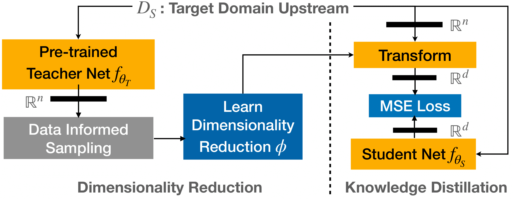

# Specialized Embedding Approximation Training Pipeline
This repository contains the training code for Specialized Embedding Approximation in the context of urban noise classification as described in our IEEE ICASSP 2021 paper [Specialized Embedding Approximation for Edge Intelligence: A Case Study in Urban Sound Classification](https://ieeexplore.ieee.org/document/9414287).

## Overview of Training Pipeline
The pipeline for solving Specialized Embedding Approximation (SEA) involves two components: (i) Dimensionality Reduction and (ii) Knowledge Distillation. The first step corresponds to learning a dimensionality reduction function  from the teacher embedding model's data space  to the student's subspace . In order to reduce the memory and compute complexity associated with learning  without compromising the geometric interpretation in the  subspace, we use a sampling technique to choose a representative subset of data points from the student's training data. The second step is to transform the teacher's embeddings in the student's data space using , and then train the student to learn the resulting embeddings using Mean Squared Error (MSE) loss. The overall pipeline is outlined below:



## Knowledge Distillation Pipeline
### Prerequisites
1. [Miniconda](https://docs.conda.io/en/latest/miniconda.html)
2. `libsndfile`: On Windows and macOS, these will be installed via `pip`. However, on Linux this must be installed manually via your platform's package manager. For Debian-based distributions (such as Ubuntu), this can be done by running:

    ```
    apt-get install libsndfile1
    ```
3. [Gooogle Sheets API](https://developers.google.com/sheets/api/quickstart/python#prerequisites): Complete the _Prerequisites_ step of [creating a project with the API enabled](https://developers.google.com/workspace/guides/create-project). Next, create the following tabs on your GSheet:

    i) Create tab `embedding_approx_mse` for upstream (embedding) training results. Create the following columns on Row 1:
    
       | Username | Model Dir | Train Data Dir | Valid Data Dir | Emb Train Dir | Emb Valid Dir | Approximation mode | Emb key | Model Representation | Student Emb Len | # Epochs | Train Epoch Size | Valid Epoch Size | Train Batch Size | Valid Batch Size | Random State | Learning Rate | # GPUs | Checkpoint Interval | Latest Epoch | Latest Train Loss | Latest Valid Loss | Latest Train MAE | Latest Valid MAE | Best Train Loss | Best Valid Loss | Best Train MAE | Best Valid MAE |
       
    ii) Create tab `sonyc_ust` for downstream (classifier) training results. Create the following columns on Row 1:
    
       | Username | Model Type | Upstream Data | Commit | Annotation Dir | Taxonomy Dir | Feature Dir | Output Dir | Exp. ID | Hidden Layer Size | Num. Hidden Layers | Learning Rate | L2 Reg. | Batch Size | Num Epochs | Patience | Sensor Factor | Proximity Factor | No Standardize | Co-occurrence Loss | Co-occurrence Loss Factor | PCA | PCA Components | Label Mode | Oversample | Oversample Iters. | Threshold Type | Target Mode | No Timestamp | Split Path | Optimizer | Micro AUPRC | Micro F1 (@0.5) | Macro AUPRC | Coarse Tag AUPRC |
       
     **IMPORTANT:** Maintain the above order of columns. Do not sort the columns on the GSheets. Doing so would have the columns wrongly populated by the the respective training pipelines.
    
### Setup
Create a virtual environment `l3embedding-tf-12-gpu` using the `l3embedding-tf-12-gpu.yml` file in this repository:
```
conda env create -f l3embedding-tf-12-gpu.yml
```

### Knowledge Distillation Training (Upstream)
Knowledge Distillation training involves submitting the following job (assuming  is PCA) on a SLURM HPC system: `embedding-approx/jobs/emb_approx_mse/upstream/03-train-approx-embedding-pca.sbatch`.

The following parameters in the job need to be set by the user:

| Parameter           | Explanation                                                                                                   |
| ------------------- | ------------------------------------------------------------------------------------------------------------- |
| APPROX_MODE         | The dimensionality reduction function used to transform teacher data ('pca' or 'umap')                        |
| ASR                 | Sampling rate of student audio input representation                                                           |
| NUM_MELS            | Number of melspectrogram bins in student audio input representation                                           |
| NUM_DFT             | DFT size                                                                                                      |
| HOP_LEN             | DFT hop length in student audio input representation                                                          |
| AUDIO_DIR           | Path to raw in-domain audio files partitiond into train and validate subfolders                               |
| EMBEDDING_DIR       | Path to transformed teacher embeddings on the above audio files partitiond into train and validate subfolders |
| OUTPUT_DIR          | Path to output directory                                                                                      |
| GOOGLE_DEV_APP_NAME | Name of GSheet for updating training results                                                                  |
| GSHEET_ID           | Gsheet ID obtained from URL                                                                                   |

After these have been set, run the following on your HPC:
```
cd jobs/emb_approx_mse/upstream/
sbatch 03-train-approx-embedding-pca.sbatch
```

You can keep tracking the GSheet for training progress.

### Embedding Extranction on Downstream (SONY-UST) Dataset
Download the annotated [SONYC-UST dataset](https://zenodo.org/record/3693077#.YMJX_vlKiUk). To extract embeddings on the data using the trained student model, run the job `jobs/emb_approx_mse/downstream/sonyc_ust/05-generate-embedding-samples-pca.sbatch`, setting the following parameters: 

| Parameter           | Explanation                                                                                                   |
| ------------------- | ------------------------------------------------------------------------------------------------------------- |
| ASR                 | Sampling rate of student audio input representation                                                           |
| NUM_MELS            | Number of melspectrogram bins in student audio input representation                                           |
| NUM_DFT             | DFT size                                                                                                      |
| HOP_LEN             | DFT hop length in student audio input representation                                                          |
| L3_MODEL_PATH       | Path to best model in trained student model directory (Check column _Model Dir_ on GSheet tab `embedding_approx_mse`)                |
| SONYC_UST_PATH      | Path to SONYC-UST data                                                                                        |
| OUTPUT_DIR          | Path to output directory                                                                                      |

Note that you can directly use our trained SEA student models on downstream data; for details, refer to the [`edgel3`](https://pypi.org/project/edgel3/) Python package.

## How to Cite
Kindly cite our work as:

```
@inproceedings{srivastava2021specialized,
  title={Specialized Embedding Approximation for Edge Intelligence: A Case Study in Urban Sound Classification},
  author={Srivastava, Sangeeta and Roy, Dhrubojyoti and Cartwright, Mark and Bello, Juan P and Arora, Anish},
  booktitle={ICASSP 2021-2021 IEEE International Conference on Acoustics, Speech and Signal Processing (ICASSP)},
  pages={8378--8382},
  year={2021},
  organization={IEEE}
}
```
